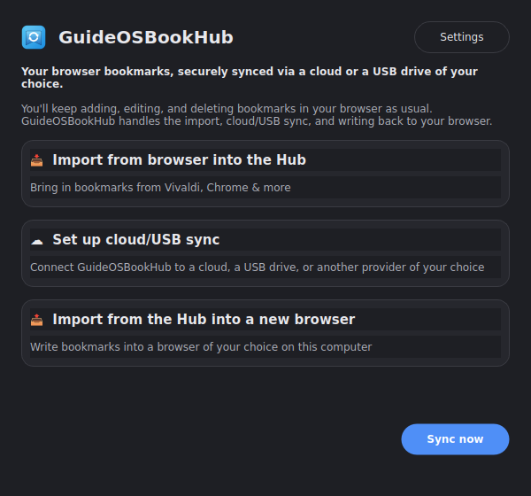
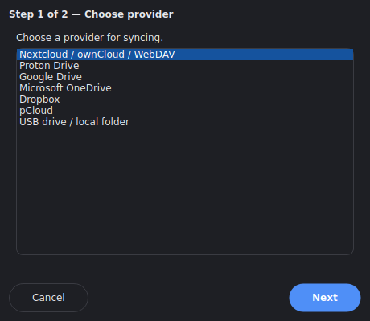

[Deutsch](README.md) | [English](README.en.md)

# GuideOSBookHub

A sync bridge for browser bookmarks on Linux: adding, editing, and
deleting individual bookmarks stays where it belongs – in the browser
itself.

This project was built in collaboration with [Claude](https://claude.com).

## How it works

```
Vivaldi/Chrome/Edge/...  <-->  GuideOSBookHub  <-->  Cloud or USB drive
   (browser profile)        (import, sync,             (via rclone, 70+
                              write-back)                storage services)
```

GuideOSBookHub takes care of three things:

1. **Import** – reads bookmarks straight from the browser profile
   automatically (no manual export needed).
2. **Cloud/USB sync** – keeps them in sync across multiple devices via a
   cloud provider of your choice or a USB drive.
3. **Write-back** – writes the synced set back into a (possibly
   different) browser on demand.

Unlike the sister project [NEXTBookmarks](https://github.com/Stephan-Lefty/nextbookmarks)
(a browser extension plus its own server app tied to Nextcloud),
GuideOSBookHub is a standalone desktop application with no
bookmark-editing UI of its own and no commitment to a single cloud
provider.

The app itself is **distribution- and desktop-independent**: built on
PyQt6 (runs identically under GNOME, KDE, XFCE, ...), supports **German
and English** (switchable anytime) as well as light/dark mode, and is
available in four installation formats (see [Installation](#installation)).



## Features

- **Automatic browser import**: detects Vivaldi, Google Chrome, Chromium,
  Brave, Microsoft Edge, and Opera automatically at their default profile
  location and imports directly – for anything else (e.g. Firefox), the
  manual HTML export remains available as a fallback.
- **Cloud sync wizard** right in the app, no terminal knowledge required:
  WebDAV/Nextcloud/ownCloud (credentials), Proton Drive (credentials +
  optional 2FA), Google Drive, Microsoft OneDrive, Dropbox, pCloud (each
  via browser sign-in), plus a local folder or USB drive (no cloud account
  needed).
- **Write bookmarks back to a browser** with three selectable strategies:
  merge, into a separate folder, or full replace – with a safety check
  confirming the target browser is actually closed.
- Multiple independent **sync profiles** at once (e.g. "Work" → Nextcloud,
  "Personal" → Proton Drive) – each top-level folder can be assigned to a
  profile, subfolders inherit it.
- Automatic and manual sync, runs on a background thread (never blocks the
  UI), with a progress indicator.
- Two-way sync with conflict resolution (newer change wins), deletions are
  tracked via tombstones.
- Checks for `rclone` on startup; if missing, offers a one-click install
  dialog (see [Installing rclone](#installing-rclone)).

## Requirements

- Python 3.10+ and PyQt6 (already included in AppImage/Flatpak/.deb)
- [rclone](https://rclone.org) – not strictly required upfront: if
  missing, the app offers to install it via dialog. AppImage and Flatpak
  bundle their own rclone anyway.

## Installation

Four equivalent options, depending on how much you want to manage
yourself:

| Format | Distribution-independent | Bundles rclone | Best for |
|---|---|---|---|
| AppImage | ✅ any x86_64 distro | ✅ | Single file, no root needed |
| Flatpak | ✅ any distro with Flatpak | ✅ (sandboxed) | Clean desktop integration |
| `.deb` | Debian/Ubuntu and derivatives | – (`Recommends`) | Native apt integration |
| pip/pipx | ✅ any distro with Python 3.10+ | – | Development, full control |

### AppImage (any distribution, x86_64)

```bash
./packaging/appimage/build.sh
```

Builds `packaging/appimage/build/GuideOSBookHub-x86_64.AppImage` –
bundles its own Python venv (incl. PyQt6) plus a static rclone binary,
runs without installation via double-click/`./GuideOSBookHub-x86_64.AppImage`.
Requires [appimagetool](https://github.com/AppImage/appimagetool/releases)
on the PATH.

### Flatpak (any distribution with Flatpak)

```bash
./packaging/flatpak/build.sh
flatpak run io.github.stephanlefty.GuideOSBookHub
```

Builds and installs the Flatpak for the current user, including a
sandboxed rclone. Requires `flatpak` and `flatpak-builder`, plus a one-time
`org.freedesktop.Platform//23.08` + `org.freedesktop.Sdk//23.08` +
`org.freedesktop.Sdk.Extension.python3//23.08` (see comment in the script).

### `.deb` package (Debian/Ubuntu and derivatives)

```bash
./packaging/deb/build.sh
sudo apt install ./packaging/deb/build/guideosbookhub_0.1.0_all.deb
```

Installs `guideosbookhub` system-wide including a menu entry; rclone is
only listed as `Recommends`, not a hard dependency.

Alternatively: on every version tag (`vX.Y.Z`), a GitHub Actions pipeline
builds AppImage, Flatpak, and `.deb` automatically and attaches them to
the corresponding
[release](https://github.com/Stephan-Lefty/GuideOSBookHub/releases) –
no building required.

### pip/pipx (any distribution, for development)

```bash
pipx install .
```

Or in a virtual environment:

```bash
python3 -m venv .venv
source .venv/bin/activate
pip install -e .
```

The `guideosbookhub` command is then available.

```bash
cp guideosbookhub.desktop ~/.local/share/applications/
```

additionally integrates the app into the application menu (adjust the
icon path if the project directory is moved).

## Installing rclone

AppImage and Flatpak already bundle their own up-to-date rclone – nothing
further to do there. For `.deb`/pip/pipx, the app checks on first launch
whether a system `rclone` is found; if not, a dialog with an "Install"
button appears. Clicking it triggers the official rclone install script,
secured via a graphical PolicyKit prompt (`pkexec`) – works regardless of
distribution or desktop environment, no terminal needed. Alternatively, at
any time: `sudo apt install rclone` or the installer from
[rclone.org](https://rclone.org/downloads/).

## Getting started

On first launch, GuideOSBookHub walks you straight through setup:

1. **Choose a browser** – bookmarks are found and imported automatically.
2. **Set up cloud or USB sync** (optional, can be done later from the home
   screen) – pick a provider, enter credentials, or sign in via browser.



Both steps can be repeated anytime from the home screen ("Import from
browser into the Hub", "Set up cloud/USB sync", "Import from the Hub into
a new browser"). For JottaCloud and iCloud Drive, which the wizard doesn't
cover (as of now), the way in remains a remote set up manually via
`rclone config` – then used in **Settings** via "New profile".

## Folder structure

```
GuideOSBookHub/
├── core/                       # Pure logic, no Qt dependency
│   ├── browser_bookmarks.py      # Read/write Chromium bookmarks
│   ├── importer.py               # Netscape HTML import (Firefox fallback)
│   ├── cloud_providers.py        # Provider registry (WebDAV, Proton Drive, ...)
│   ├── rclone.py                 # All rclone subprocess calls
│   ├── sync.py                   # Two-way sync engine
│   ├── repository.py             # SQLite access
│   ├── settings.py               # Settings (JSON)
│   └── i18n.py                   # German/English translations
├── gui/                        # PyQt6 interface
│   ├── home_window.py            # Home screen
│   ├── browser_import_dialog.py
│   ├── cloud_setup_dialog.py
│   ├── export_to_browser_dialog.py
│   ├── settings_dialog.py
│   └── theme.py                  # Light/dark mode stylesheet
├── packaging/                  # Build scripts for AppImage/Flatpak/.deb
└── tests/
```

## Known limitations

- No locking at the rclone level: if two devices sync within the same
  second, the last push wins (an acceptable trade-off for a personal
  tool).
- Conflict resolution is deliberately simple (newer change wins, no
  prompt) – see `core/sync.py`.
- JottaCloud and iCloud Drive are deliberately not covered by the setup
  wizard (unreliable non-interactive rclone setup); they still work via
  remotes configured manually with `rclone config`.

## Development

```bash
pip install -e . pytest
python3 guideosbookhub.py
```

Tests live under `tests/` (`python -m pytest -q`).

## Reporting bugs

Please file bugs and ideas for next steps at
[github.com/Stephan-Lefty/GuideOSBookHub/issues](https://github.com/Stephan-Lefty/GuideOSBookHub/issues).

## License

GPL-3.0-or-later, see [LICENSE](LICENSE).
