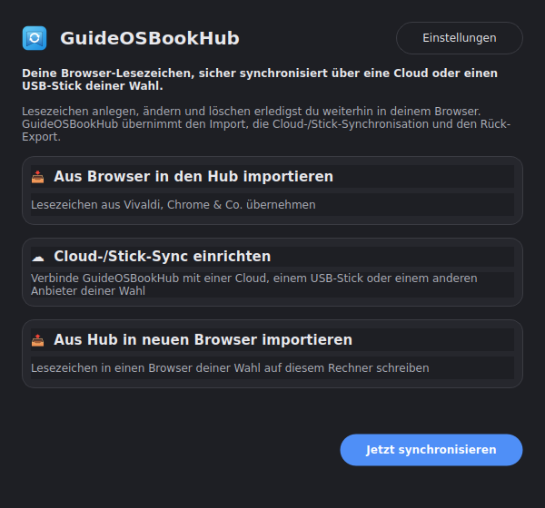
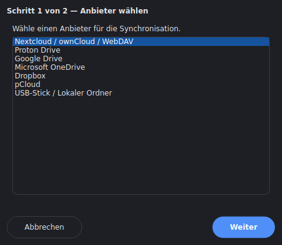

[Deutsch](README.md) | [English](README.en.md)

# GuideOSBookHub

Eine Sync-Brücke für Browser-Lesezeichen unter Linux: Anlegen, Ändern und
Löschen einzelner Lesezeichen bleibt dort, wo es hingehört – im Browser
selbst.

Dieses Projekt ist in Zusammenarbeit mit [Claude](https://claude.com)
entstanden.

## Wie es funktioniert

```
Vivaldi/Chrome/Edge/...  <-->  GuideOSBookHub  <-->  Cloud oder USB-Stick
   (Browser-Profil)         (Import, Sync,           (via rclone, 70+
                              Rück-Export)              Speicherdienste)
```

GuideOSBookHub übernimmt drei Dinge:

1. **Import** – liest die Lesezeichen automatisch direkt aus dem
   Browser-Profil (kein manueller Export nötig).
2. **Cloud-/Stick-Sync** – hält sie über eine frei wählbare Cloud oder
   einen USB-Stick zwischen mehreren Geräten synchron.
3. **Rück-Export** – schreibt den synchronisierten Bestand bei Bedarf in
   einen (auch anderen) Browser zurück.

Anders als das Schwesterprojekt [NEXTBookmarks](https://github.com/Stephan-Lefty/nextbookmarks)
(Browser-Extension + eigene, fest auf Nextcloud zugeschnittene
Server-App) ist GuideOSBookHub eine eigenständige Desktop-Anwendung ohne
eigene Lesezeichen-Verwaltungsoberfläche und ohne Festlegung auf einen
einzelnen Cloud-Anbieter.

Die App selbst ist **distributions- und Desktop-unabhängig**: sie basiert
auf PyQt6 (läuft identisch unter GNOME, KDE, XFCE, ...), unterstützt
**Deutsch und Englisch** (jederzeit umschaltbar) sowie Hell-/Dunkelmodus,
und steht in vier Installationsformen zur Verfügung (siehe
[Installation](#installation)).



## Funktionsumfang

- **Automatischer Browser-Import**: erkennt Vivaldi, Google Chrome,
  Chromium, Brave, Microsoft Edge und Opera automatisch am Standard-Profil-
  pfad und importiert direkt – für alles andere (z.B. Firefox) steht der
  manuelle HTML-Export als Rückfalloption bereit.
- **Cloud-Sync-Assistent** direkt in der App, keine Terminal-Kenntnisse
  nötig: WebDAV/Nextcloud/ownCloud (Zugangsdaten), Proton Drive
  (Zugangsdaten + optionale 2FA), Google Drive, Microsoft OneDrive,
  Dropbox, pCloud (jeweils per Browser-Login) sowie ein lokaler Ordner
  oder USB-Stick (kein Cloud-Konto nötig).
- **Rück-Export in den Browser** mit drei wählbaren Strategien:
  Zusammenführen, in einen gesonderten Ordner, oder komplettes Ersetzen –
  mit Sicherheitsabfrage, ob der Ziel-Browser wirklich geschlossen ist.
- Mehrere unabhängige **Sync-Profile** gleichzeitig (z.B. "Arbeit" →
  Nextcloud, "Privat" → Proton Drive) – jeder Top-Level-Ordner kann einem
  Profil zugewiesen werden, Unterordner erben davon.
- Automatischer und manueller Sync, läuft im Hintergrund-Thread (blockiert
  die Oberfläche nicht), mit Fortschrittsanzeige.
- Zwei-Wege-Sync mit Konfliktlösung (neuere Änderung gewinnt), Löschungen
  werden über Tombstones nachvollzogen.
- Prüft beim Start, ob `rclone` vorhanden ist; falls nicht, öffnet sich ein
  Dialog, der die Installation per Klick anbietet (siehe
  [rclone-Installation](#rclone-installation)).

## Voraussetzungen

- Python 3.10+ und PyQt6 (bei AppImage/Flatpak/.deb bereits enthalten)
- [rclone](https://rclone.org) – wird nicht zwingend vorab benötigt: fehlt
  es, bietet die App selbst eine Installation per Dialog an. AppImage und
  Flatpak bringen ohnehin ein eigenes rclone mit.

## Installation

Vier gleichwertige Wege stehen zur Auswahl – je nachdem, wie viel man
selbst verwalten möchte:

| Format | Distributions-unabhängig | Bringt rclone mit | Geeignet für |
|---|---|---|---|
| AppImage | ✅ jede x86_64-Distro | ✅ | Einzelne Datei, kein Root nötig |
| Flatpak | ✅ jede Distro mit Flatpak | ✅ (im Sandbox) | Saubere Desktop-Integration |
| `.deb` | Debian/Ubuntu und Derivate | – (`Recommends`) | Native apt-Integration |
| pip/pipx | ✅ jede Distro mit Python 3.10+ | – | Entwicklung, volle Kontrolle |

### AppImage (jede Distribution, x86_64)

```bash
./packaging/appimage/build.sh
```

Baut `packaging/appimage/build/GuideOSBookHub-x86_64.AppImage` – bündelt
einen eigenen Python-Venv (inkl. PyQt6) sowie ein statisches rclone-Binary,
läuft ohne Installation direkt per Doppelklick/`./GuideOSBookHub-x86_64.AppImage`.
Voraussetzung zum Bauen: [appimagetool](https://github.com/AppImage/appimagetool/releases)
im PATH.

### Flatpak (jede Distribution mit Flatpak)

```bash
./packaging/flatpak/build.sh
flatpak run io.github.stephanlefty.GuideOSBookHub
```

Baut und installiert das Flatpak für den aktuellen Nutzer, inkl. gebündeltem
rclone im Sandbox. Voraussetzung: `flatpak` und `flatpak-builder`, sowie
einmalig `org.freedesktop.Platform//24.08` + `org.freedesktop.Sdk//24.08`
(siehe Kommentar im Skript).

### `.deb`-Paket (Debian/Ubuntu und Derivate)

```bash
./packaging/deb/build.sh
sudo apt install ./packaging/deb/build/guideosbookhub_0.1.0_all.deb
```

Installiert `guideosbookhub` systemweit inkl. Menüeintrag; rclone ist nur
als `Recommends` eingetragen, nicht als harte Abhängigkeit.

Alternativ: bei jedem Versions-Tag (`vX.Y.Z`) baut eine GitHub-Actions-
Pipeline AppImage, Flatpak und `.deb` automatisch und hängt sie an das
zugehörige [Release](https://github.com/Stephan-Lefty/GuideOSBookHub/releases)
an – kein eigenes Bauen nötig.

### pip/pipx (jede Distribution, für Entwicklung)

```bash
pipx install .
```

Alternativ in einer virtuellen Umgebung:

```bash
python3 -m venv .venv
source .venv/bin/activate
pip install -e .
```

Danach steht der Befehl `guideosbookhub` zur Verfügung.

```bash
cp guideosbookhub.desktop ~/.local/share/applications/
```

integriert die App zusätzlich ins Anwendungsmenü (Icon-Pfad ggf. anpassen,
falls das Projektverzeichnis verschoben wird).

## rclone-Installation

AppImage und Flatpak bringen bereits ein eigenes, aktuelles rclone mit –
hier ist nichts weiter zu tun. Bei `.deb`/pip/pipx wird beim ersten Start
geprüft, ob ein System-`rclone` gefunden wird; falls nicht, erscheint ein
Dialog mit einem "Installieren"-Button. Der Klick löst das offizielle
rclone-Installationsskript aus, abgesichert über eine grafische
PolicyKit-Rechteabfrage (`pkexec`) – funktioniert unabhängig von
Distribution und Desktop-Umgebung, ganz ohne Terminal. Alternativ jederzeit
manuell: `sudo apt install rclone` oder der Installer von
[rclone.org](https://rclone.org/downloads/).

## Erste Schritte

Beim allerersten Start führt GuideOSBookHub direkt durch die Einrichtung:

1. **Browser wählen** – die Lesezeichen werden automatisch gefunden und
   importiert.
2. **Cloud- oder Stick-Sync einrichten** (optional, jederzeit später über
   die Startseite nachholbar) – Anbieter auswählen, Zugangsdaten eingeben
   oder im Browser anmelden.



Beides lässt sich jederzeit erneut über die Startseite aufrufen
("Aus Browser in den Hub importieren", "Cloud-/Stick-Sync einrichten",
"Aus Hub in neuen Browser importieren"). Für JottaCloud und iCloud Drive,
die der Assistent (Stand jetzt) nicht abdeckt, bleibt der Weg über ein
manuell mit `rclone config` eingerichtetes Remote – anschließend in den
**Einstellungen** über "Neues Profil" verwenden.

## Ordnerstruktur

```
GuideOSBookHub/
├── core/                       # Reine Logik, ohne Qt-Abhängigkeit
│   ├── browser_bookmarks.py      # Chromium-Bookmarks lesen/schreiben
│   ├── importer.py               # Netscape-HTML-Import (Firefox-Fallback)
│   ├── cloud_providers.py        # Anbieter-Registry (WebDAV, Proton Drive, ...)
│   ├── rclone.py                 # Alle rclone-Subprozessaufrufe
│   ├── sync.py                   # Zwei-Wege-Sync-Engine
│   ├── repository.py             # SQLite-Zugriff
│   ├── settings.py               # Einstellungen (JSON)
│   └── i18n.py                   # Deutsch/Englisch-Übersetzungen
├── gui/                        # PyQt6-Oberfläche
│   ├── home_window.py            # Startseite
│   ├── browser_import_dialog.py
│   ├── cloud_setup_dialog.py
│   ├── export_to_browser_dialog.py
│   ├── settings_dialog.py
│   └── theme.py                  # Hell-/Dunkelmodus-Stylesheet
├── packaging/                  # Bau-Skripte für AppImage/Flatpak/.deb
└── tests/
```

## Bekannte Grenzen

- Kein Locking auf rclone-Ebene: synchronisieren zwei Geräte im selben
  Sekundenfenster, gewinnt der zuletzt schreibende Push (für ein
  persönliches Tool ein akzeptabler Kompromiss).
- Konfliktlösung ist bewusst einfach gehalten (neuere Änderung gewinnt,
  ohne Rückfrage) – siehe `core/sync.py`.
- JottaCloud und iCloud Drive sind im Einrichtungs-Assistenten bewusst
  nicht abgedeckt (unzuverlässige nicht-interaktive rclone-Einrichtung);
  funktionieren aber weiterhin über manuell per `rclone config`
  eingerichtete Remotes.

## Entwicklung

```bash
pip install -e . pytest
python3 guideosbookhub.py
```

Tests liegen unter `tests/` (`python -m pytest -q`).

## Bugs melden

Fehler und Ideen für nächste Schritte bitte unter
[github.com/Stephan-Lefty/GuideOSBookHub/issues](https://github.com/Stephan-Lefty/GuideOSBookHub/issues)
eintragen.

## Lizenz

GPL-3.0-or-later, siehe [LICENSE](LICENSE).
